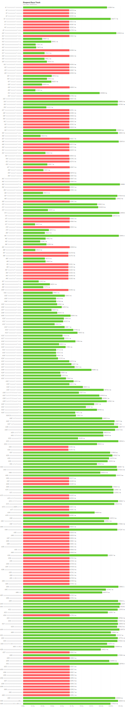
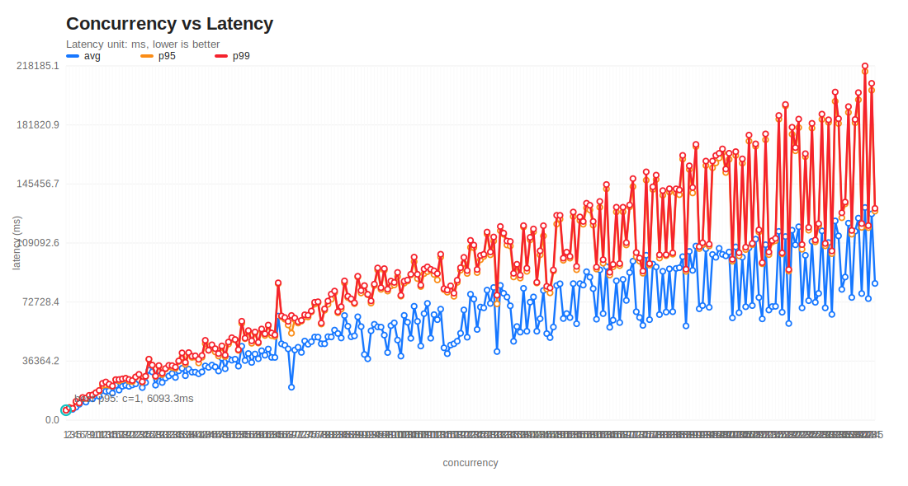
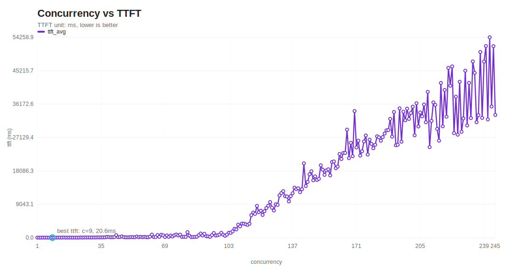

# HuizhouPowerQAAgent 并发压测报告

## 运行概览

| 指标 | 值 |
|---|---|
| started_at | 2026-03-21T22:19:08.832315+00:00 |
| finished_at | 2026-03-21T22:21:20.359739+00:00 |
| elapsed_sec | 131.527 |
| throughput_rps | 1.863 |
| output_tokens_total | 35994 |
| throughput_tokens_per_sec | 273.662 |
| total_requests | 245 |
| success_requests | 148 |
| error_requests | 97 |
| success_rate | 60.408% |
| peak_task_concurrency | 245 |

## 请求赛道图

说明：图中的横轴时间来自每个请求的 `request_started_at` 和 `request_ended_at`，纵轴任务按 `request_started_at` 升序排列。

## 延迟统计（仅成功请求）

- total_ms: `{"min": 16247.463, "max": 131471.141, "avg": 84181.8, "p50": 99763.334, "p90": 128028.458, "p95": 128727.619, "p99": 130426.174}`
- ttft_ms: `{"min": 52.245, "max": 62964.706, "avg": 33233.607, "p50": 34241.933, "p90": 62766.785, "p95": 62794.603, "p99": 62953.235}`

## 其他统计

- status_code_counts: `{"200": 191, "500": 9, "None": 45}`
- error_type_counts: `{"ServerDisconnectedError": 45}`

## 并发 vs 延迟曲线（阶梯压测）

## 并发 vs TTFT 曲线（阶梯压测）

- 最优 p95 点: concurrency=1, p95=6093.285ms

| concurrency | avg_ms | p95_ms | p99_ms | ttft_avg_ms | throughput_rps | token/s | success_rate |
|---|---:|---:|---:|---:|---:|---:|---:|
| 1 | 6093.285 | 6093.285 | 6093.285 | 28.27 | 0.164 | 48.41 | 100.0% |
| 2 | 6990.266 | 7666.584 | 7726.702 | 25.211 | 0.258 | 56.569 | 100.0% |
| 3 | 6627.035 | 7206.483 | 7218.277 | 21.868 | 0.415 | 86.948 | 100.0% |
| 4 | 7950.135 | 11074.327 | 11538.509 | 45.844 | 0.343 | 64.598 | 100.0% |
| 5 | 9768.711 | 10490.567 | 10530.457 | 23.521 | 0.474 | 124.635 | 100.0% |
| 6 | 11635.264 | 13771.267 | 13923.793 | 36.429 | 0.43 | 103.419 | 100.0% |
| 7 | 11071.078 | 13362.988 | 13560.461 | 23.575 | 0.514 | 117.368 | 100.0% |
| 8 | 13850.713 | 15069.785 | 15243.401 | 24.417 | 0.523 | 136.364 | 100.0% |
| 9 | 13122.864 | 15437.28 | 15478.443 | 20.566 | 0.581 | 142.281 | 100.0% |
| 10 | 15085.348 | 16855.818 | 16872.392 | 29.736 | 0.592 | 142.89 | 100.0% |
| 11 | 14662.161 | 17780.281 | 18278.687 | 28.236 | 0.598 | 140.399 | 100.0% |
| 12 | 18143.158 | 21322.598 | 22632.594 | 42.882 | 0.523 | 127.108 | 100.0% |
| 13 | 17718.108 | 21647.027 | 23498.301 | 41.809 | 0.542 | 153.816 | 100.0% |
| 14 | 17985.322 | 21416.166 | 22119.303 | 35.651 | 0.628 | 164.853 | 100.0% |
| 15 | 16565.557 | 20796.491 | 20996.692 | 71.848 | 0.713 | 167.443 | 100.0% |
| 16 | 21392.884 | 24885.544 | 24923.891 | 37.412 | 0.642 | 158.962 | 100.0% |
| 17 | 18460.355 | 24087.746 | 24978.493 | 41.258 | 0.674 | 167.23 | 100.0% |
| 18 | 20837.957 | 24965.966 | 25395.184 | 37.858 | 0.706 | 177.41 | 100.0% |
| 19 | 21421.843 | 25685.495 | 25752.245 | 49.719 | 0.737 | 180.887 | 100.0% |
| 20 | 20800.286 | 24029.313 | 25013.892 | 41.764 | 0.792 | 182.908 | 100.0% |
| 21 | 21664.984 | 23696.263 | 24399.428 | 39.11 | 0.854 | 199.44 | 100.0% |
| 22 | 22325.44 | 26426.798 | 26596.762 | 30.287 | 0.826 | 196.299 | 100.0% |
| 23 | 24693.201 | 27842.876 | 28185.881 | 35.42 | 0.814 | 205.042 | 100.0% |
| 24 | 20038.29 | 23313.545 | 23697.136 | 67.57 | 1.009 | 241.124 | 100.0% |
| 25 | 23132.561 | 26980.427 | 27023.291 | 37.757 | 0.925 | 229.717 | 100.0% |
| 26 | 30737.806 | 37403.57 | 37553.478 | 70.105 | 0.692 | 173.212 | 100.0% |
| 27 | 29702.636 | 33782.142 | 33878.331 | 54.887 | 0.796 | 194.707 | 100.0% |
| 28 | 21528.623 | 26839.3 | 27129.357 | 65.885 | 1.032 | 257.023 | 100.0% |
| 29 | 27294.627 | 33220.699 | 33588.698 | 57.954 | 0.86 | 206.645 | 100.0% |
| 30 | 23165.8 | 28041.645 | 28957.791 | 57.377 | 1.027 | 246.506 | 100.0% |
| 31 | 25874.278 | 31449.953 | 31769.352 | 82.761 | 0.974 | 231.84 | 100.0% |
| 32 | 27160.982 | 32945.069 | 33717.466 | 56.86 | 0.939 | 222.114 | 100.0% |
| 33 | 28691.041 | 32441.508 | 33552.333 | 93.79 | 0.97 | 238.167 | 100.0% |
| 34 | 26278.627 | 31911.348 | 32649.127 | 87.68 | 1.037 | 246.43 | 100.0% |
| 35 | 30316.497 | 36091.211 | 36457.173 | 78.241 | 0.958 | 243.089 | 100.0% |
| 36 | 31924.586 | 38644.801 | 41423.931 | 103.718 | 0.848 | 202.859 | 100.0% |
| 37 | 27362.551 | 34341.137 | 35611.335 | 88.117 | 1.024 | 253.04 | 100.0% |
| 38 | 31372.539 | 40854.924 | 41574.571 | 219.826 | 0.91 | 224.06 | 100.0% |
| 39 | 29538.165 | 38625.718 | 39328.206 | 175.283 | 0.982 | 232.292 | 100.0% |
| 40 | 29529.251 | 38784.893 | 39597.617 | 134.8 | 0.999 | 243.044 | 100.0% |
| 41 | 28543.861 | 35207.052 | 37439.119 | 135.289 | 1.075 | 266.844 | 100.0% |
| 42 | 29702.416 | 38695.696 | 39771.621 | 165.089 | 1.043 | 256.143 | 97.619% |
| 43 | 33382.383 | 47109.315 | 49133.52 | 692.842 | 0.863 | 209.144 | 100.0% |
| 44 | 32506.261 | 42997.989 | 43043.194 | 163.634 | 1.021 | 246.243 | 97.727% |
| 45 | 33851.961 | 45216.487 | 46387.501 | 189.716 | 0.967 | 237.555 | 100.0% |
| 46 | 32752.215 | 41984.914 | 43991.139 | 340.775 | 1.031 | 258.185 | 100.0% |
| 47 | 30240.442 | 39446.861 | 40995.485 | 169.07 | 1.138 | 276.98 | 100.0% |
| 48 | 38255.235 | 44807.05 | 45699.655 | 112.057 | 1.047 | 260.242 | 100.0% |
| 49 | 31643.458 | 39120.938 | 40042.418 | 105.5 | 1.21 | 310.555 | 100.0% |
| 50 | 37697.882 | 46849.27 | 48085.444 | 109.43 | 1.024 | 245.335 | 100.0% |
| 51 | 36909.525 | 49620.993 | 50752.123 | 180.398 | 1.002 | 245.736 | 100.0% |
| 52 | 37525.9 | 49421.457 | 49606.902 | 140.007 | 1.047 | 255.898 | 100.0% |
| 53 | 33230.398 | 42951.537 | 43381.18 | 137.735 | 1.215 | 308.917 | 100.0% |
| 54 | 45486.687 | 59607.641 | 60891.565 | 318.652 | 0.883 | 224.582 | 100.0% |
| 55 | 36714.288 | 50153.982 | 50482.967 | 132.594 | 1.085 | 273.895 | 100.0% |
| 56 | 41016.337 | 54179.939 | 55143.948 | 256.49 | 1.014 | 262.734 | 100.0% |
| 57 | 35507.083 | 47331.742 | 48830.426 | 142.72 | 1.163 | 301.624 | 100.0% |
| 58 | 40703.847 | 53506.549 | 54286.224 | 235.343 | 1.06 | 249.469 | 100.0% |
| 59 | 37806.779 | 47464.426 | 47920.552 | 141.942 | 1.229 | 294.791 | 100.0% |
| 60 | 42717.743 | 54969.211 | 56114.183 | 140.327 | 1.065 | 255.254 | 100.0% |
| 61 | 39957.399 | 52145.86 | 53163.471 | 299.013 | 1.141 | 278.533 | 100.0% |
| 62 | 43780.239 | 58006.707 | 58533.864 | 839.827 | 1.057 | 259.919 | 100.0% |
| 63 | 38640.9 | 52010.393 | 53659.448 | 180.057 | 1.164 | 277.307 | 100.0% |
| 64 | 38600.336 | 51550.169 | 52517.9 | 183.009 | 1.214 | 288.44 | 100.0% |
| 65 | 64070.153 | 84034.284 | 84561.903 | 726.547 | 0.767 | 58.37 | 33.846% |
| 66 | 46981.519 | 63578.781 | 64169.597 | 241.579 | 1.021 | 244.291 | 100.0% |
| 67 | 46083.204 | 62144.657 | 63150.626 | 807.818 | 1.061 | 267.047 | 100.0% |
| 68 | 43876.528 | 58594.799 | 60845.502 | 652.915 | 1.115 | 262.686 | 100.0% |
| 69 | 20239.139 | 53517.0 | 64445.763 | 197.418 | 1.027 | 25.29 | 8.696% |
| 70 | 43191.767 | 61868.207 | 62866.905 | 606.733 | 1.107 | 272.215 | 100.0% |
| 71 | 44866.787 | 59784.144 | 60639.113 | 231.042 | 1.159 | 272.729 | 100.0% |
| 72 | 41707.098 | 60961.275 | 61421.615 | 593.209 | 1.169 | 275.217 | 100.0% |
| 73 | 48714.001 | 63678.72 | 64875.747 | 341.086 | 1.125 | 279.952 | 100.0% |
| 74 | 46742.45 | 63506.402 | 64575.927 | 665.211 | 1.143 | 271.678 | 100.0% |
| 75 | 48310.615 | 66661.09 | 67192.245 | 869.831 | 1.113 | 261.014 | 100.0% |
| 76 | 51159.918 | 71427.986 | 72579.738 | 614.511 | 1.046 | 260.662 | 100.0% |
| 77 | 51122.787 | 72264.707 | 72906.009 | 828.737 | 1.046 | 256.966 | 100.0% |
| 78 | 47042.708 | 59180.776 | 59779.149 | 216.53 | 1.301 | 313.574 | 98.718% |
| 79 | 47021.439 | 67654.083 | 68505.568 | 244.835 | 1.151 | 269.187 | 100.0% |
| 80 | 51369.822 | 71330.14 | 73340.103 | 212.936 | 1.09 | 272.122 | 100.0% |
| 81 | 51210.146 | 74395.332 | 77592.438 | 1506.364 | 1.011 | 233.353 | 100.0% |
| 82 | 55428.159 | 78501.633 | 79491.741 | 555.147 | 1.023 | 244.062 | 100.0% |
| 83 | 53364.767 | 66103.278 | 66752.732 | 158.815 | 1.222 | 302.676 | 100.0% |
| 84 | 50595.36 | 68379.61 | 69841.61 | 204.314 | 1.181 | 281.507 | 100.0% |
| 85 | 64419.29 | 84481.613 | 85736.311 | 201.688 | 0.978 | 250.251 | 100.0% |
| 86 | 57840.638 | 75481.748 | 76291.844 | 262.681 | 1.127 | 272.231 | 98.837% |
| 87 | 51340.694 | 74228.213 | 74693.239 | 678.827 | 1.16 | 272.946 | 98.851% |
| 88 | 51891.242 | 71704.837 | 72227.694 | 1138.001 | 1.211 | 290.43 | 100.0% |
| 89 | 63646.41 | 88116.591 | 88608.429 | 612.436 | 1.001 | 249.541 | 100.0% |
| 90 | 57609.075 | 78299.45 | 79825.852 | 1060.478 | 1.124 | 277.392 | 100.0% |
| 91 | 40433.786 | 82670.812 | 82856.629 | 406.234 | 1.097 | 87.072 | 32.967% |
| 92 | 37760.946 | 77234.302 | 77481.841 | 369.488 | 1.185 | 113.933 | 39.13% |
| 93 | 55006.182 | 72049.553 | 73422.088 | 230.751 | 1.264 | 309.625 | 100.0% |
| 94 | 59018.75 | 82872.116 | 83760.533 | 705.001 | 1.111 | 269.285 | 100.0% |
| 95 | 57437.821 | 92446.81 | 93718.616 | 1268.481 | 1.009 | 138.09 | 56.842% |
| 96 | 57292.628 | 80529.358 | 81576.456 | 612.239 | 1.161 | 290.227 | 100.0% |
| 97 | 52349.838 | 92321.682 | 93303.239 | 670.98 | 1.036 | 154.619 | 62.887% |
| 98 | 41629.863 | 79451.906 | 80647.963 | 843.244 | 1.209 | 86.762 | 28.571% |
| 99 | 58196.105 | 82606.136 | 85638.335 | 1337.085 | 1.147 | 282.052 | 100.0% |
| 100 | 59889.539 | 83203.007 | 84808.283 | 815.84 | 1.177 | 276.593 | 100.0% |
| 101 | 49293.677 | 88411.271 | 90956.273 | 525.952 | 1.101 | 164.231 | 58.416% |
| 102 | 39421.905 | 76339.171 | 76854.281 | 830.036 | 1.322 | 151.173 | 48.039% |
| 103 | 64503.113 | 84327.626 | 85572.275 | 1351.297 | 1.192 | 291.386 | 100.0% |
| 104 | 60286.055 | 85644.125 | 86275.192 | 1324.448 | 1.199 | 292.463 | 99.038% |
| 105 | 50405.91 | 89443.878 | 89829.743 | 1713.016 | 1.166 | 175.831 | 59.048% |
| 106 | 70125.048 | 97592.342 | 100405.267 | 2420.322 | 1.05 | 261.733 | 100.0% |
| 107 | 60829.857 | 87160.491 | 89812.835 | 2241.302 | 1.184 | 290.568 | 100.0% |
| 108 | 45629.993 | 82279.001 | 83160.126 | 3545.687 | 1.298 | 176.785 | 54.63% |
| 109 | 65582.777 | 90244.756 | 93069.362 | 3062.807 | 1.161 | 293.532 | 100.0% |
| 110 | 71887.74 | 91430.568 | 94409.833 | 3836.834 | 1.146 | 287.935 | 100.0% |
| 111 | 50462.407 | 92192.169 | 92902.853 | 3811.338 | 1.19 | 173.66 | 61.261% |
| 112 | 64974.026 | 89719.901 | 91960.566 | 3634.176 | 1.207 | 288.468 | 100.0% |
| 113 | 61869.785 | 86343.111 | 90249.893 | 3475.933 | 1.242 | 301.895 | 100.0% |
| 114 | 68338.26 | 100390.226 | 102173.113 | 3780.1 | 1.112 | 269.898 | 100.0% |
| 115 | 44515.671 | 80384.868 | 80929.627 | 6111.354 | 1.416 | 200.103 | 57.391% |
| 116 | 40925.038 | 78783.222 | 80156.655 | 6798.483 | 1.431 | 157.783 | 44.828% |
| 117 | 46222.384 | 80434.457 | 82712.586 | 6463.201 | 1.406 | 209.627 | 58.12% |
| 118 | 47003.783 | 76254.401 | 78200.982 | 8622.372 | 1.506 | 199.868 | 55.085% |
| 119 | 48581.206 | 84844.935 | 86165.345 | 6916.482 | 1.377 | 186.131 | 54.622% |
| 120 | 53479.582 | 92341.659 | 93865.843 | 7308.459 | 1.278 | 213.77 | 65.0% |
| 121 | 67848.1 | 96684.899 | 100226.263 | 6171.797 | 1.202 | 296.332 | 100.0% |
| 122 | 51060.438 | 90323.455 | 92112.778 | 7176.292 | 1.302 | 200.108 | 62.295% |
| 123 | 77533.02 | 106387.016 | 110710.011 | 8032.32 | 1.088 | 258.992 | 99.187% |
| 124 | 74548.87 | 106230.939 | 107809.354 | 8666.27 | 1.147 | 273.897 | 100.0% |
| 125 | 55836.472 | 90880.724 | 92796.632 | 9656.106 | 1.341 | 211.067 | 65.6% |
| 126 | 69649.632 | 98778.444 | 101390.427 | 8126.368 | 1.24 | 310.225 | 100.0% |
| 127 | 69158.946 | 100796.351 | 102120.546 | 7364.561 | 1.235 | 308.054 | 100.0% |
| 128 | 80063.557 | 114545.407 | 115830.491 | 9057.508 | 1.101 | 272.319 | 100.0% |
| 129 | 71857.029 | 101819.292 | 103565.583 | 8892.532 | 1.243 | 299.594 | 100.0% |
| 130 | 81694.097 | 110342.143 | 112791.819 | 11438.862 | 1.149 | 284.7 | 100.0% |
| 131 | 42224.35 | 71580.706 | 76941.842 | 12085.8 | 1.697 | 215.313 | 52.672% |
| 132 | 82958.262 | 116644.91 | 119267.3 | 12603.215 | 1.09 | 274.745 | 100.0% |
| 133 | 78101.227 | 114473.207 | 115157.807 | 11229.997 | 1.151 | 275.507 | 100.0% |
| 134 | 75799.821 | 107878.364 | 110350.227 | 11159.185 | 1.201 | 299.957 | 99.254% |
| 135 | 70400.439 | 107244.535 | 110039.184 | 9815.061 | 1.222 | 297.75 | 100.0% |
| 136 | 48520.952 | 88164.226 | 90414.517 | 11268.645 | 1.499 | 222.268 | 61.765% |
| 137 | 57639.941 | 94724.216 | 95983.785 | 12024.005 | 1.419 | 251.903 | 71.533% |
| 138 | 54186.285 | 87460.544 | 89292.372 | 13558.674 | 1.533 | 265.673 | 70.29% |
| 139 | 81166.544 | 118933.638 | 119789.546 | 13163.46 | 1.151 | 279.316 | 99.281% |
| 140 | 54728.611 | 91614.028 | 93558.853 | 13381.284 | 1.495 | 254.172 | 70.714% |
| 141 | 72659.005 | 111033.158 | 112572.316 | 12324.057 | 1.245 | 306.95 | 100.0% |
| 142 | 75850.755 | 115924.806 | 117744.751 | 13125.557 | 1.201 | 285.553 | 100.0% |
| 143 | 54736.793 | 84455.112 | 84864.694 | 20132.444 | 1.68 | 250.903 | 58.042% |
| 144 | 62456.498 | 101797.015 | 104285.176 | 14001.106 | 1.364 | 247.313 | 73.611% |
| 145 | 79847.0 | 113436.237 | 119740.323 | 15095.166 | 1.203 | 299.407 | 100.0% |
| 146 | 53281.853 | 80798.179 | 82419.498 | 17168.484 | 1.764 | 288.819 | 65.068% |
| 147 | 50833.153 | 78366.107 | 81431.193 | 17996.397 | 1.794 | 272.374 | 61.224% |
| 148 | 57335.518 | 91809.993 | 92453.922 | 15541.915 | 1.584 | 295.033 | 73.649% |
| 149 | 82905.804 | 120761.254 | 126138.188 | 16608.339 | 1.164 | 287.238 | 100.0% |
| 150 | 83984.389 | 123805.257 | 126125.899 | 15634.8 | 1.177 | 279.332 | 100.0% |
| 151 | 62564.081 | 98438.123 | 99763.153 | 15954.202 | 1.479 | 286.479 | 79.47% |
| 152 | 65595.286 | 103128.217 | 103441.292 | 19606.902 | 1.468 | 261.028 | 69.737% |
| 153 | 63173.043 | 99736.074 | 100846.668 | 18421.54 | 1.486 | 251.341 | 71.242% |
| 154 | 84062.75 | 125382.86 | 128175.258 | 17022.508 | 1.188 | 288.091 | 100.0% |
| 155 | 59363.007 | 92631.823 | 94704.184 | 18229.925 | 1.604 | 264.711 | 67.742% |
| 156 | 84076.903 | 122887.012 | 125163.881 | 18516.397 | 1.233 | 294.016 | 99.359% |
| 157 | 83163.926 | 120631.133 | 122365.775 | 16863.703 | 1.262 | 302.447 | 99.363% |
| 158 | 91404.07 | 130681.646 | 133584.629 | 20484.809 | 1.171 | 286.162 | 99.367% |
| 159 | 88068.948 | 129471.753 | 132347.629 | 20649.171 | 1.195 | 287.925 | 100.0% |
| 160 | 80972.016 | 120100.812 | 122379.192 | 18820.226 | 1.306 | 315.205 | 100.0% |
| 161 | 62146.476 | 93053.033 | 94262.922 | 19249.012 | 1.694 | 287.758 | 67.702% |
| 162 | 92545.575 | 131075.377 | 134694.403 | 22665.483 | 1.195 | 294.78 | 100.0% |
| 163 | 65585.744 | 96632.632 | 98823.961 | 21306.279 | 1.643 | 274.143 | 65.644% |
| 164 | 94523.054 | 142396.476 | 145122.149 | 22943.639 | 1.121 | 277.458 | 100.0% |
| 165 | 57167.116 | 89321.173 | 91061.941 | 22966.048 | 1.809 | 288.57 | 64.242% |
| 166 | 61593.127 | 94430.714 | 95926.24 | 29263.951 | 1.725 | 227.187 | 54.217% |
| 167 | 85787.497 | 128221.161 | 131136.623 | 21529.086 | 1.255 | 304.784 | 100.0% |
| 168 | 60083.371 | 95141.591 | 96449.305 | 25698.393 | 1.74 | 267.895 | 60.714% |
| 169 | 86663.248 | 128280.806 | 131117.953 | 22066.566 | 1.283 | 320.594 | 100.0% |
| 170 | 73719.006 | 107889.524 | 109311.608 | 34299.66 | 1.54 | 187.886 | 48.824% |
| 171 | 90912.144 | 131391.751 | 132534.44 | 24427.659 | 1.275 | 317.104 | 100.0% |
| 172 | 97891.756 | 143825.928 | 148757.774 | 26260.479 | 1.151 | 286.565 | 100.0% |
| 173 | 66729.496 | 100651.712 | 103210.319 | 22228.263 | 1.659 | 274.944 | 67.63% |
| 174 | 63237.76 | 97918.912 | 99834.729 | 23407.559 | 1.739 | 288.606 | 66.092% |
| 175 | 58357.963 | 90455.699 | 91821.948 | 26052.611 | 1.897 | 278.538 | 58.286% |
| 176 | 101529.22 | 147781.811 | 152929.937 | 27682.916 | 1.145 | 278.303 | 99.432% |
| 177 | 61865.453 | 95438.056 | 96417.397 | 22522.1 | 1.819 | 300.196 | 65.537% |
| 178 | 96080.15 | 142070.2 | 143719.642 | 26542.049 | 1.233 | 297.837 | 100.0% |
| 179 | 94350.431 | 148228.33 | 150898.494 | 25402.598 | 1.175 | 285.572 | 100.0% |
| 180 | 64992.089 | 99768.756 | 101802.418 | 24232.834 | 1.765 | 290.718 | 66.111% |
| 181 | 91671.371 | 138484.73 | 141369.456 | 25161.544 | 1.278 | 315.393 | 98.895% |
| 182 | 66538.404 | 101274.697 | 101891.221 | 27453.335 | 1.766 | 288.906 | 64.835% |
| 183 | 93159.452 | 140404.702 | 142514.87 | 27170.445 | 1.268 | 319.62 | 100.0% |
| 184 | 66771.249 | 102193.092 | 103028.29 | 26248.444 | 1.769 | 243.222 | 57.609% |
| 185 | 93412.771 | 139867.534 | 142460.266 | 27234.886 | 1.295 | 304.757 | 100.0% |
| 186 | 93852.625 | 138840.274 | 141795.071 | 28204.321 | 1.296 | 313.103 | 100.0% |
| 187 | 100680.325 | 160764.547 | 163060.803 | 29071.644 | 1.143 | 284.386 | 100.0% |
| 188 | 58017.839 | 91654.629 | 92926.701 | 29148.018 | 2.015 | 297.204 | 58.511% |
| 189 | 103931.749 | 154401.009 | 156642.517 | 32171.961 | 1.19 | 287.946 | 100.0% |
| 190 | 92245.829 | 139911.511 | 143275.001 | 27354.295 | 1.322 | 315.472 | 99.474% |
| 191 | 107206.167 | 168460.316 | 169820.729 | 34039.982 | 1.122 | 284.963 | 100.0% |
| 192 | 68573.356 | 105658.972 | 106875.065 | 25021.907 | 1.774 | 304.593 | 68.75% |
| 193 | 70549.328 | 108041.198 | 109237.645 | 25166.146 | 1.761 | 287.132 | 67.358% |
| 194 | 105555.783 | 156831.24 | 159560.2 | 35024.744 | 1.21 | 294.878 | 100.0% |
| 195 | 69492.198 | 107245.191 | 108342.28 | 25983.703 | 1.793 | 276.306 | 62.051% |
| 196 | 102017.335 | 155398.065 | 159581.309 | 34118.945 | 1.217 | 308.452 | 100.0% |
| 197 | 100285.332 | 158438.844 | 163003.799 | 31781.913 | 1.2 | 293.838 | 99.492% |
| 198 | 105805.536 | 161438.301 | 164333.383 | 34945.898 | 1.179 | 292.386 | 100.0% |
| 199 | 102118.573 | 164674.948 | 167054.105 | 32156.72 | 1.189 | 285.639 | 100.0% |
| 200 | 101173.928 | 152515.818 | 154630.404 | 33768.77 | 1.282 | 317.283 | 100.0% |
| 201 | 103535.357 | 160582.339 | 164390.451 | 35475.804 | 1.219 | 297.253 | 100.0% |
| 202 | 62978.962 | 97861.876 | 99028.797 | 27723.204 | 2.006 | 274.411 | 57.426% |
| 203 | 106678.024 | 163015.941 | 165370.664 | 36407.982 | 1.22 | 301.749 | 100.0% |
| 204 | 66162.585 | 101179.965 | 103090.988 | 30111.719 | 1.975 | 265.285 | 55.882% |
| 205 | 100350.647 | 158212.187 | 160911.404 | 33895.029 | 1.263 | 309.534 | 100.0% |
| 206 | 69821.306 | 105060.257 | 106513.166 | 32856.465 | 1.921 | 256.959 | 53.883% |
| 207 | 106129.912 | 171858.705 | 175576.438 | 36070.648 | 1.165 | 285.384 | 100.0% |
| 208 | 70551.605 | 108065.887 | 108800.339 | 31258.036 | 1.906 | 260.266 | 53.846% |
| 209 | 111463.686 | 168652.558 | 170167.979 | 39480.662 | 1.213 | 299.674 | 100.0% |
| 210 | 75510.045 | 115885.534 | 117179.131 | 24523.687 | 1.775 | 295.738 | 70.0% |
| 211 | 62357.695 | 96301.517 | 96987.837 | 31628.989 | 2.173 | 267.94 | 48.815% |
| 212 | 108037.743 | 172688.422 | 176302.307 | 36633.184 | 1.189 | 294.649 | 99.528% |
| 213 | 67809.686 | 101911.34 | 103542.402 | 35964.345 | 2.055 | 217.193 | 42.723% |
| 214 | 69934.051 | 109679.509 | 110542.493 | 29455.832 | 1.929 | 280.633 | 58.879% |
| 215 | 70067.764 | 110541.027 | 111920.355 | 26261.552 | 1.898 | 309.763 | 67.907% |
| 216 | 116251.573 | 185363.759 | 187643.458 | 41897.474 | 1.144 | 272.132 | 100.0% |
| 217 | 66453.071 | 102348.856 | 103009.507 | 30152.861 | 2.086 | 302.685 | 57.143% |
| 218 | 113055.67 | 193539.434 | 194420.819 | 40002.701 | 1.119 | 273.191 | 99.541% |
| 219 | 59524.55 | 91787.317 | 92753.271 | 32757.877 | 2.336 | 259.902 | 45.205% |
| 220 | 116957.948 | 176092.865 | 180391.07 | 45984.944 | 1.204 | 300.422 | 100.0% |
| 221 | 107964.441 | 165915.528 | 167856.827 | 41144.739 | 1.309 | 323.176 | 100.0% |
| 222 | 119095.694 | 180191.116 | 185417.261 | 46375.004 | 1.192 | 299.754 | 100.0% |
| 223 | 69103.878 | 105225.802 | 108117.098 | 28308.649 | 2.052 | 295.669 | 59.641% |
| 224 | 101498.023 | 162218.3 | 164117.588 | 38168.28 | 1.354 | 316.472 | 99.554% |
| 225 | 73579.623 | 116971.699 | 118723.77 | 27901.448 | 1.871 | 299.558 | 67.556% |
| 226 | 110060.9 | 179864.673 | 182809.391 | 42221.127 | 1.232 | 303.251 | 99.558% |
| 227 | 72561.853 | 109801.178 | 110923.97 | 28662.624 | 2.038 | 315.452 | 62.115% |
| 228 | 78044.917 | 119626.595 | 120979.828 | 32286.988 | 1.87 | 253.231 | 56.14% |
| 229 | 116567.807 | 185226.952 | 188488.107 | 45222.698 | 1.205 | 295.366 | 99.127% |
| 230 | 69118.359 | 107335.209 | 108796.776 | 30382.519 | 2.081 | 299.988 | 59.13% |
| 231 | 109368.365 | 183394.739 | 185001.791 | 41923.482 | 1.236 | 319.995 | 100.0% |
| 232 | 65124.653 | 102546.816 | 104184.042 | 32387.136 | 2.211 | 295.258 | 53.879% |
| 233 | 122700.095 | 196374.702 | 202077.825 | 47729.584 | 1.141 | 287.806 | 100.0% |
| 234 | 113466.658 | 182704.831 | 185674.48 | 44616.071 | 1.255 | 312.743 | 100.0% |
| 235 | 80532.959 | 124648.533 | 127711.442 | 31260.62 | 1.828 | 257.516 | 57.021% |
| 236 | 88122.823 | 133193.009 | 134317.333 | 33187.349 | 1.741 | 257.082 | 59.746% |
| 237 | 121317.719 | 189491.401 | 193103.773 | 50280.353 | 1.22 | 300.607 | 99.578% |
| 238 | 75542.543 | 114506.552 | 116833.547 | 32437.542 | 2.022 | 287.924 | 57.143% |
| 239 | 116366.979 | 183184.335 | 185195.439 | 47677.278 | 1.281 | 316.04 | 100.0% |
| 240 | 124413.944 | 197307.684 | 201732.714 | 51895.437 | 1.184 | 294.02 | 100.0% |
| 241 | 77968.441 | 118689.123 | 121086.996 | 32009.952 | 1.957 | 271.261 | 55.602% |
| 242 | 130955.002 | 214746.087 | 218185.116 | 54258.894 | 1.103 | 272.893 | 100.0% |
| 243 | 74829.203 | 118573.815 | 119833.493 | 35512.341 | 2.023 | 270.551 | 55.144% |
| 244 | 127041.3 | 203197.584 | 207450.407 | 51859.134 | 1.169 | 286.294 | 100.0% |
| 245 | 84181.8 | 128727.619 | 130426.174 | 33233.607 | 1.863 | 273.662 | 60.408% |